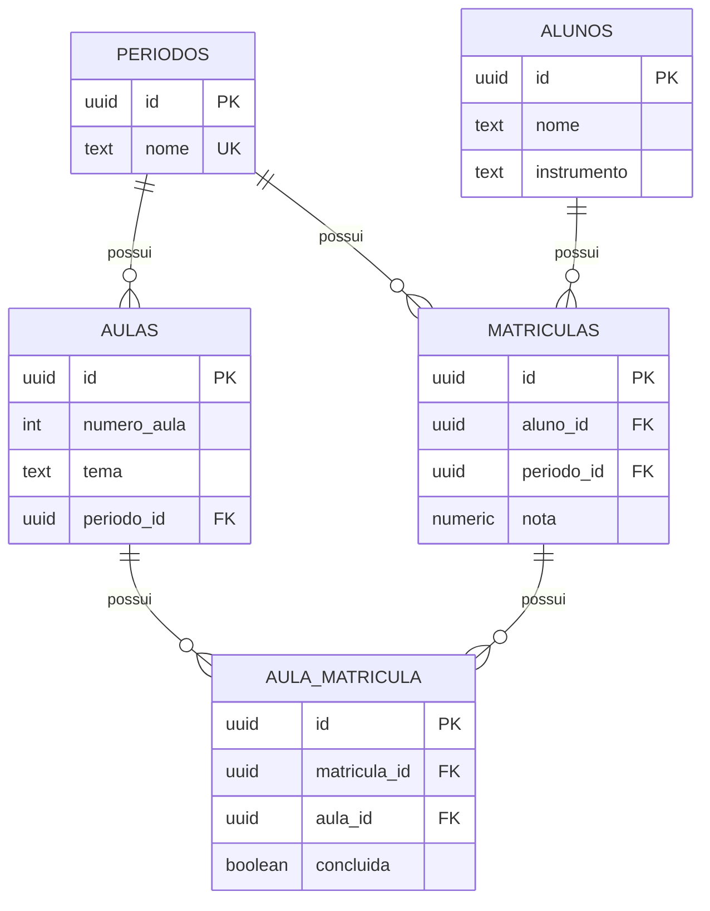

# Sonora

Aplicação web em Next.js para gerenciamento de alunos, períodos, aulas e acompanhamento de progresso musical. O projeto já está integrado ao Supabase e substituiu os mocks por leitura e gravação reais no banco.

## Visão geral

O fluxo atual cobre três áreas principais:

- Cadastro e listagem de períodos, com criação do período e de suas aulas no mesmo fluxo.
- Cadastro e listagem de alunos, vinculando cada aluno a um período e criando a matrícula e as aulas pendentes automaticamente.
- Página de detalhe do aluno, com troca entre os períodos cursados, matrícula em novos períodos, atualização de nota e confirmação de aulas concluídas.

## Stack

- Next.js 16 com App Router
- React 19
- TypeScript
- Tailwind CSS v4
- Supabase (`@supabase/supabase-js`)

## Estrutura de pastas

```
sonora/
├── public/                          # Assets estáticos
└── src/
    ├── proxy.ts                     # Middleware do Next.js: atualiza a sessão do Supabase em cada request
    ├── app/
    │   ├── layout.tsx               # Layout raiz (html/body, fontes, estilos globais)
    │   ├── globals.css              # Estilos globais e configuração do Tailwind CSS v4
    │   ├── login/
    │   │   └── page.tsx             # Tela de login
    │   └── (protected)/             # Route group com as rotas autenticadas da aplicação
    │       ├── layout.tsx           # Layout das páginas protegidas (header, navegação)
    │       ├── page.tsx             # Página inicial com atalhos para alunos e períodos
    │       ├── periodos/
    │       │   ├── page.tsx         # Listagem e cadastro de períodos
    │       │   └── actions.ts       # Server Actions: criar período e suas aulas
    │       └── alunos/
    │           ├── page.tsx         # Listagem e cadastro de alunos (um card por aluno)
    │           ├── actions.ts       # Server Actions: criar aluno + matrícula + aulas pendentes
    │           └── [id]/            # [id] = id do aluno
    │               ├── page.tsx     # Detalhe do aluno: período atual, nota e progresso por aula
    │               └── actions.ts   # Server Actions: trocar período, adicionar período, atualizar nota e marcar aula concluída
    ├── components/
    │   ├── header.tsx               # Cabeçalho das páginas protegidas
    │   ├── nav-card.tsx             # Atalho de navegação na home
    │   ├── periodo-box.tsx          # Card de exibição de um período e suas aulas
    │   ├── periodos-client.tsx      # Lógica client-side da página de períodos (modal, listagem)
    │   ├── novo-periodo-modal.tsx   # Modal de criação de período + aulas
    │   ├── aluno-card.tsx           # Card de exibição de um aluno na listagem de alunos
    │   ├── alunos-client.tsx        # Lógica client-side da página de alunos (modal, listagem)
    │   ├── novo-aluno-modal.tsx     # Modal de criação de aluno/matrícula
    │   ├── aluno-detalhe-client.tsx # Lógica client-side da página de detalhe do aluno
    │   ├── periodo-switcher.tsx     # Botão/dropdown para alternar entre os períodos do aluno
    │   ├── novo-periodo-aluno-modal.tsx # Modal para matricular o aluno em um novo período
    │   ├── aula-check-card.tsx      # Checkbox de conclusão de uma aula da matrícula
    │   ├── progress-bar.tsx         # Barra de progresso de aulas concluídas
    │   └── modal.tsx                # Componente genérico de modal
    ├── services/
    │   └── auth/
    │       └── actions.ts           # Server Actions de autenticação (login/logout)
    └── lib/
        └── supabase/
            ├── client.ts            # Cliente Supabase para uso no browser
            ├── server.ts            # Cliente Supabase para uso em Server Components/Actions
            ├── proxy.ts             # Helper de atualização de sessão usado pelo proxy.ts (middleware)
            ├── database.types.ts    # Tipos gerados a partir do schema do Supabase
            └── queries/
                ├── periodos.ts      # Queries de leitura/escrita da tabela periodos
                ├── aulas.ts         # Queries de leitura/escrita da tabela aulas
                ├── alunos.ts        # Queries de leitura/escrita da tabela alunos
                └── matriculas.ts    # Queries de leitura/escrita das tabelas matriculas e aula_matricula
```

## Rotas

- `/` - página inicial com atalhos para alunos e períodos
- `/periodos` - listagem e cadastro de períodos
- `/alunos` - listagem e cadastro de alunos
- `/alunos/[id]` - detalhe de um aluno (`id` do aluno), com troca de período, nota e progresso por aula

## Funcionalidades

### Períodos

- Lista os períodos cadastrados no banco.
- Permite criar um período e, no mesmo fluxo, cadastrar as aulas dele.
- Exibe as aulas de cada período na listagem.

### Alunos

- Lista todos os alunos cadastrados, um card por aluno, inclusive os sem matrícula (exibidos como "Sem período").
- O card mostra instrumento, período atual e progresso. O período atual é o de maior nome entre as matrículas do aluno.
- Permite cadastrar um aluno escolhendo um período existente.
- Cria automaticamente o aluno, a matrícula e os registros de aulas da matrícula com `concluida = false`.

### Detalhe do aluno

- Exibe nome, instrumento, período e barra de progresso.
- O período é um botão: ao clicar, alterna entre os períodos em que o aluno está matriculado. Nota, progresso e aulas mudam conforme o período escolhido, e o histórico dos demais é preservado.
- O botão "+" matricula o aluno em outro período existente, criando a matrícula e as aulas pendentes.
- Permite salvar a nota da matrícula.
- Permite marcar/desmarcar aulas como concluídas com confirmação.

## Banco de dados

O projeto usa o Postgres do Supabase com o schema abaixo. Todas as tabelas usam `uuid` como chave primária, gerado com `gen_random_uuid()`.

```sql
create table periodos (
  id uuid primary key default gen_random_uuid(),
  nome text not null unique -- ex: "S1/2027"
);

create table alunos (
  id uuid primary key default gen_random_uuid(),
  nome text not null,
  instrumento text not null
);

-- vínculo aluno <-> período (1 linha por período cursado)
create table matriculas (
  id uuid primary key default gen_random_uuid(),
  aluno_id uuid not null references alunos(id) on delete cascade,
  periodo_id uuid not null references periodos(id),
  nota numeric(4,2), -- null até ser lançada
  unique (aluno_id, periodo_id)
);

create table aulas (
  id uuid primary key default gen_random_uuid(),
  numero_aula int not null,
  tema text not null,
  periodo_id uuid not null references periodos(id)
);

-- progresso do aluno em cada aula, escopado à matrícula (período) específica
create table aula_matricula (
  id uuid primary key default gen_random_uuid(),
  matricula_id uuid not null references matriculas(id) on delete cascade,
  aula_id uuid not null references aulas(id) on delete cascade,
  concluida boolean not null default false,
  unique (matricula_id, aula_id)
);
```

### Relacionamento entre as tabelas



### Descrição das tabelas

- **`periodos`** - representa um período letivo (ex: `"S1/2027"`). O campo `nome` é único e serve como identificador legível do período.
- **`alunos`** - dados cadastrais do aluno (`nome` e `instrumento`). Um aluno não guarda nota nem progresso diretamente; isso fica em `matriculas` e `aula_matricula`, pois o mesmo aluno pode cursar múltiplos períodos.
- **`matriculas`** - vínculo entre um aluno e um período, com **uma linha por período cursado** (restrição `unique (aluno_id, periodo_id)`). É aqui que fica a `nota` do aluno naquele período; o valor é `null` até ser lançada. Se o aluno for excluído, suas matrículas são removidas em cascata (`on delete cascade`).
- **`aulas`** - catálogo de aulas de um período, com `numero_aula` (ordem) e `tema`. As aulas pertencem ao período (`periodo_id`), não a um aluno específico - todos os alunos matriculados no mesmo período compartilham o mesmo conjunto de aulas.
- **`aula_matricula`** - tabela de progresso: marca se uma aula foi `concluida` para uma matrícula específica (`unique (matricula_id, aula_id)`). É o que permite que cada aluno tenha seu próprio progresso nas aulas do período em que está matriculado, mesmo com todas as matrículas do período compartilhando as mesmas aulas. Excluir a matrícula ou a aula remove o registro de progresso em cascata.

### Fluxo de criação de dados

1. Ao criar um **período**, suas **aulas** são cadastradas no mesmo fluxo (vinculadas via `periodo_id`).
2. Ao criar um **aluno** vinculado a um período, a aplicação cria em sequência: o registro em `alunos`, a `matricula` (aluno + período) e um registro em `aula_matricula` com `concluida = false` para cada aula já existente do período.
3. A nota do aluno naquele período é lançada diretamente em `matriculas.nota`.
4. O progresso é atualizado marcando/desmarcando `aula_matricula.concluida` conforme o aluno conclui cada aula.
5. Ao matricular um aluno existente em outro período, é criada uma nova `matricula` com seus registros de `aula_matricula`, sem alterar as matrículas anteriores.

### Observação importante sobre segurança

Hoje o app usa a chave anônima do Supabase no cliente. Isso exige RLS e políticas corretas no banco. Sem isso, qualquer pessoa com acesso ao front-end pode consultar e alterar dados diretamente via API do Supabase.

## Variáveis de ambiente

Crie um arquivo `.env.local` na raiz com estas chaves:

```bash
NEXT_PUBLIC_SUPABASE_URL=...
NEXT_PUBLIC_SUPABASE_ANON_KEY=...
```

## Instalação e execução

```bash
npm install
npm run dev
```

Abra [http://localhost:3000](http://localhost:3000) no navegador.

## Scripts

- `npm run dev` - inicia o ambiente de desenvolvimento
- `npm run build` - gera a build de produção
- `npm run start` - executa a build gerada
- `npm run lint` - roda o ESLint

## Validação

O projeto foi ajustado para passar em `tsc --noEmit` e `npm run lint`.

## Observações

- O login ainda não está implementado.
- O botão de sair no header é apenas visual por enquanto.
- O comportamento do app depende de o Supabase estar com RLS/policies configuradas corretamente para leitura e escrita.
